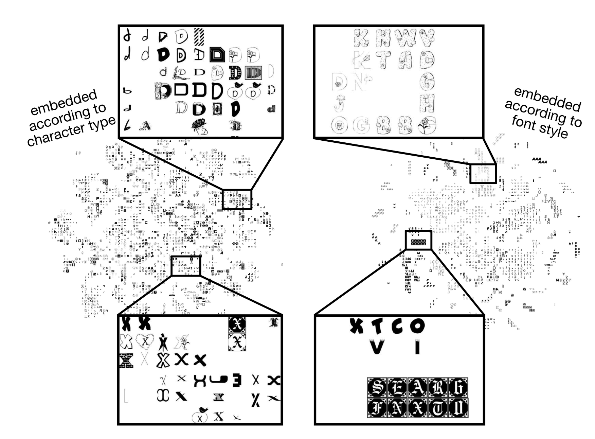

## Related work

- **Existing conditional similarity benchmarks**.
Conditional semantic similarity is a canonical task in computer vision and NLP.
The task is particularly relevant to the image domain, where even simple images have multiple aspects of interest (color, subject, action) that contribute to ambiguity in the absence of textual conditions ([Veit 2017](https://arxiv.org/abs/1603.07810)).
Subsequent work identified the same ambiguity in the text domain and proposed the conditional semantic textual similarity (C-STS) task, which measures sentence similarity conditioned on a natural language feature ([Deshpande 2023](https://aclanthology.org/2023.emnlp-main.345.pdf)).
C-STS has since been [re-annotated](https://aclanthology.org/2024.acl-long.64.pdf) [multiple times](https://huggingface.co/datasets/LivNLP/C-STS-Reannotated) and integrated as part of [MTEB](https://arxiv.org/abs/2210.07316).

  
  

    Visualization of learned subspaces for character type (left) vs. font style (right) from (<a href="https://arxiv.org/abs/1603.07810" target="_blank">Veit 2017</a>).
  

  
  

    Per-condition embeddings of the UT-Zappos-50k dataset from <a href="https://arxiv.org/abs/2204.04053" target="_blank">Ye 2022</a>.
  

- **Instruction-tuned embedding models**.
In theory, instruction-tuned embedding models can represent text with respect to arbitrary free text criteria.
In practice, this capability is limited.
Training data typically employs a small set of unique instructions (TODO cite E5).
Further,
instructions are often applied on the query-side only to enable the use of a large static index of document embeddings.
Retrieval systems typically rely on instruction-tuned rerankers to account for context-specific considerations.

- **LM-derived condition-aware embeddings**.
Recent work has leveraged standard LMs to create condition-aware representations without specialized tuning.
In particular, a strong baseline is using the final hidden state of a standard LM when asked to describe the input with respect to the criteria "in one word" ([PromptEOL](https://arxiv.org/pdf/2307.16645), [CASE](https://arxiv.org/pdf/2503.17279), [PonTE](https://arxiv.org/abs/2504.16411)).
For simple tasks, a single forward pass is more than sufficient to extract a label or descriptor for the property of interest, and the capability also has connections to in-context classification ([Zhao 2024](https://arxiv.org/pdf/2406.11233v3)).
However, while a strong starting point for condition-aware representations, this class of approaches has not yet been evaluated on more complex documents and criteria.

  
  

     In-context classification decision boundaries from <a href="https://arxiv.org/abs/2406.11233" target="_blank">Zhao 2024</a>.
  

- **Learned condition-aware embeddings**.
Recent work has customized models via specialized tuning, especially via linear projections on top of a frozen embedding model backbone.
[GSTransform](https://aclanthology.org/2025.acl-long.1196.pdf) trains condition-specific adapters, and [HyperCL](https://arxiv.org/pdf/2403.09490) generates a per-condition projection matrix on the fly, which generalizes to unseen conditions at test time.
These methods succeed on C-STS, but more complex criteria and documents likely require higher-capacity approaches.

- **Instructed retrieval**.
Conditional semantic similarity is closely related to instructed retrieval.
Benchmarks including [MAIR](https://arxiv.org/abs/2410.10127), [BRIGHT](https://brightbenchmark.github.io/), and [RaR-B](https://arxiv.org/abs/2404.06347) evaluate instruction-tuned embedding models and rerankers on retrieval tasks with realistic context and specific user preferences.
In these evaluations, relevance judgments are reasoning-intensive, and query-rewriting and/or reranking become essential to achieving strong performance.
Indeed, retrieval systems typically defer criteria-specific considerations to the reranking phase.

- **Opportunities: one-to-all vs. all-to-all**.
Recent work on embedding models has emphasized the "one-to-all" retrieval application, **documents are typically embedded without instructions.**
Specifically, typical pipelines apply instructions on the query side only. This design choice allows document embeddings to persist in a general purpose, reusable index (without needing to be re-embedded per instruction).
Dynamically re-embedding is infeasible -- each query would require O(num_docs) forward passes. Pipelines compensate for this with instruction-tuned reranking.
However, general-purpose document embeddings provide limited representational power.
We can extract a lot of information via linear probes, but ultimately limited (Weller 25).
**Criteria-specific document representations are useful.** Criteria-aware document embeddings unlock:
 semantic group-by,
 multiple views of a dataset,
 unsupervised discovery. alt: TODO:
Incorporating criteria into embeddings is relevant more broadly for applications including clustering, data deduplication, semantic groupby and other database-style operations ([Patel 2024](https://arxiv.org/abs/2407.11418)).

- **Opportunities: scope and complexity**.
C-STS and related evaluations focus primarily on simple conditions (e.g. number of people, name of object, sport mentioned) and operate over sentence-length texts.
As such, while they are sufficiently challenging to demonstrate the shortcomings of standard embedding models, they do not approach the scope and complexity of realistic applications.
In this work, we extend conditional similarity evaluations to more complex documents and criteria.
Specifically, we create a data generation pipeline where example difficulty is scalable with the strength of the LM judge.
- **Opportunities: multiple views of the same corpus**.
We also focus specifically on representing multiple views of the same corpus.
Unlike traditional STS tasks, which use `(condition, sentence1, sentence2, score)` tuples and rewrite `condition` to alter scores, this benchmark uses `(condition, anchor, positive, negative)` triplets to emphasize multiple views of the same corpus.
In addition, rather than a one-to-all retrieval task, the goal is to incorporate criteria into an all-to-all representation task. This choice has a few motivating applications. For applications requiring "specific" semantic similarity, we're currently left with either tuning specialized classification models or accepting the limitations of sentence embeddings.
For example, [semantic entropy](https://arxiv.org/abs/2302.09664) and [NoveltyBench](https://arxiv.org/abs/2504.05228) train specialized classifiers and evaluate similarity between all pairs of items in a dataset -- with a quadratic cost that necessitates use of a very small model.

## Extended related work
TODO clean this up

- jiang data diffing

- hypothesae- i like this paper bc it's so elegant https://arxiv.org/pdf/2502.04382
	- no training no nothing; just look at SAE neurons for the positive class -> do some auto interp -> see what the distinguishing features are
	- if we want to do it backward: you can create a linear probe that operates over SAE neurons as its basis
		- basically, if you want to detect neighbors-by-x-attribute, you can find a comination of neurons that are relevant to that attribute, and then figure out what the neighbors are based on those neurons
		- it's a bit roundabout no? how would you find the neurons?
		- i guess you'd have to train some meta model to tell you... like output a weighting over neurons, based on a natural language description (so what that paper does but backward)
		- and this is a lot harder
		- well you just need the same probe dataset stuff...
		- i guess you could run the forward direction a bunch of times, use that as your data, and go backward?
		- this doesn't feel as natural as just doing normal embeddings, the unsupervised stuff doesn't get you anywhere
		-
